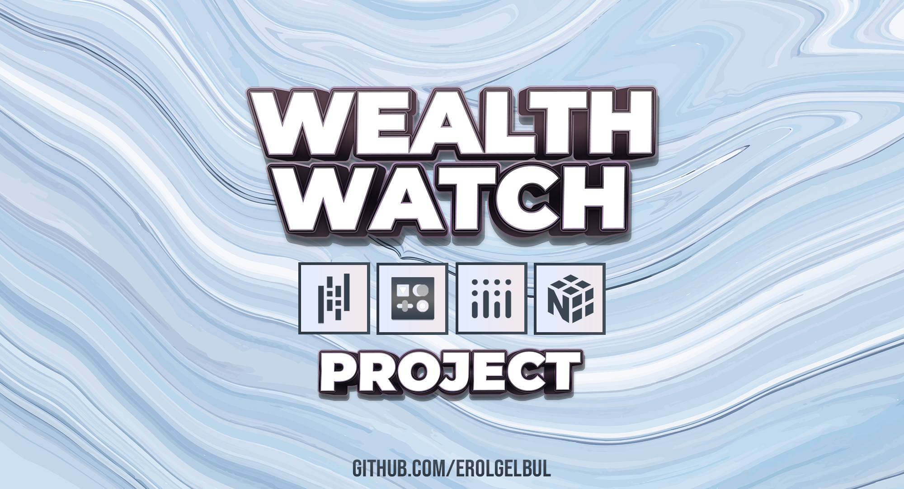
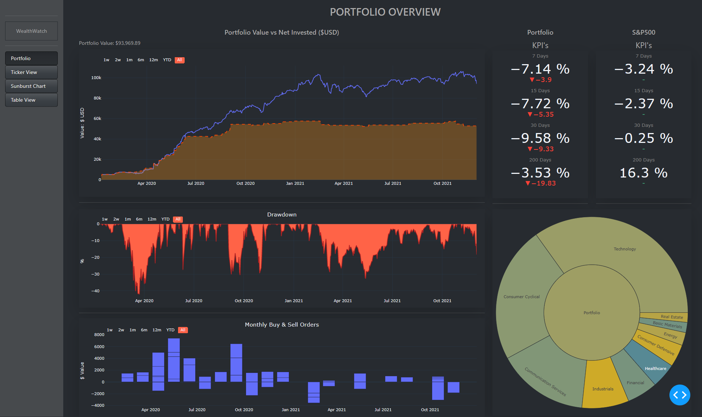
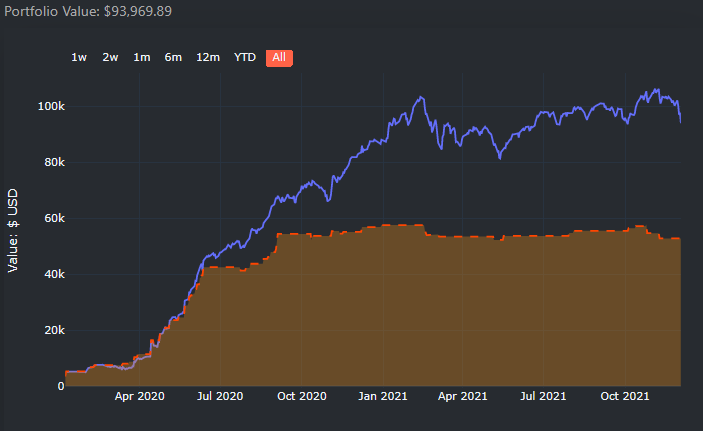
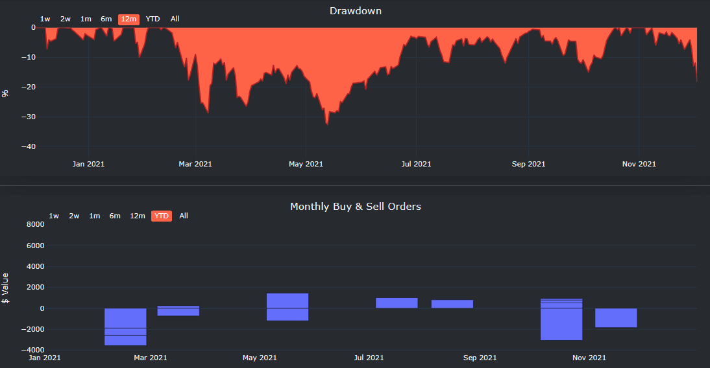
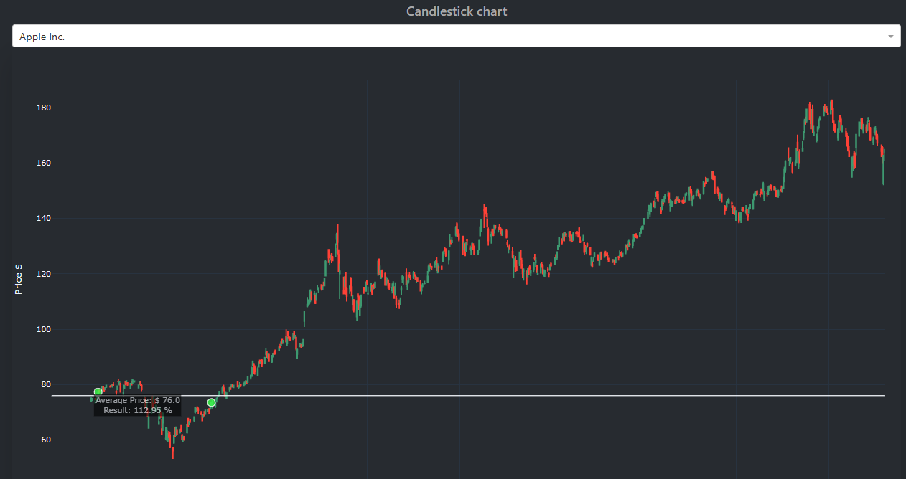

  

<!-- ABOUT THE PROJECT -->
## 1. Introduction

  

### 1.1 Overview

Keep track of your portfolio performance with WealthWatch!

### 1.2 Libraries

- [Dash](https://plotly.com/dash/)
- [plotly](https://plotly.com/)
- [NumPy](https://numpy.org/)
- [pandas](https://pandas.pydata.org/)

## 2. Functionalities

### 2.1 Portfolio Value vs Net Invested

  

### 2.2 Drawdown & Monthly Buy/Sell Orders

  

### 2.3 Candlestick Chart

  

### Interactive Sunburst View

  

<!-- CONTACT -->
## 2. Contact

Erol Gelbul - [Website](erolgelbul.com)

Project Link: [WealthWatch](https://github.com/ErolGelbul/investment_tracker)

(<a href="#top">back to top</a>)
